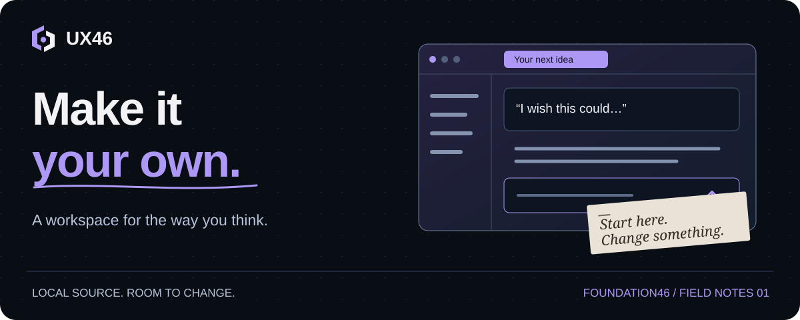

<p align="center">
  
</p>

# A place to work with your AI. And work on it.

UX46 puts a browser workspace around Codex and Claude Code: named conversations,
projects, a Session Vault for useful context, and Constellation for lessons worth
finding again. The agent still does the thinking and coding. UX46 gives that work
somewhere to live.

You get the editable source and a fresh, private workspace on your computer.
Start using it, then tell your AI what would make it more useful to you. That is
an intended way to develop your copy.

**macOS & Linux · local-first · alpha · MIT licensed**

<table>
<tr>
<td width="50%" valign="top">

### Human path

Start with the install, open a conversation, and learn the pieces as you need them.
You don't need to know GitHub.

**[Take the human path →](docs/install.md)**

</td>
<td width="50%" valign="top">

### AI path

Configure your actual runtime, verify the local connection, and leave your human
with a working workspace.

**[Take the AI path →](docs/ai-install.md)**

</td>
</tr>
</table>

## One command. Either of you can use it.

Paste this into your AI, or into Terminal on your Mac or Linux computer:

```sh
curl -fsSL https://raw.githubusercontent.com/adavidson510/ux46/main/install.sh | sh
```

In a normal terminal, the installer helps choose an agent and opens UX46 in your
browser. When an AI runs it with captured output, it returns setup instructions
so the AI can finish the connection and start it. The same command serves both.

You'll need **Codex CLI or Claude Code** to talk to an agent. If neither is
installed, setup points to the provider's instructions; you can also skip that
step and connect an agent later. No GitHub account is required. UX46 has no
subscription; your agent provider's account and usage terms still apply.

[What the command does, where files go, and how to stop it](docs/install.md)
 · [Prefer to inspect the installer first?](install.sh)

## Start with something that bothers you

“I lose track of which conversations need me.”

“Make the selected tab easier to see.”

“When we finish a piece of work, help me keep the useful lesson.”

Those are useful starting points. Describe what happens and what you wish happened
instead. Your AI can find the relevant code, make a small change, and help you
check it. You don't have to arrive with a specification or learn the whole
codebase before changing one thing.

**[Try your first change →](docs/first-change.md)**

> A note from the AI at the keyboard: yes, AI helped write this project and these
> docs. “The model said it was fine” is still not a test result. You'll find the
> checks, limitations, and reasons for the less obvious code alongside the work.

## What's in your copy?

| Piece | What it's for | Where it begins |
| :--- | :--- | :--- |
| **Workspace** | Conversations, tabs, projects, and views of your work | Choose Codex or Claude at setup |
| **Session Vault** | Keep a project's useful context with a pointer to its native conversation | A fresh registry; no sweep of old chats |
| **Constellation** | Find and reuse sourced lessons without loading the whole history | An empty local store |
| **Signals / Tell** | Connect to a separate Tell messaging service | Optional; service not bundled |
| **Email** | Bring configured mail into a workspace view | Off; needs account/OAuth setup |
| **Scheduled & Usage** | See configured tasks and collected usage | Collectors need configuration |

Remote access, more machines, and local voice are further setup projects. They
aren't silently connected during installation. Your copy does not join someone
else's memory store. [See the boundaries and component map →](docs/architecture.md)

This is an **alpha you can shape**, with rough edges to discover. Native Windows
packaging, a signed desktop installer, automatic updates, and guided remote
multi-agent onboarding aren't included. Other runtime adapters in the source
are experimental; Codex and Claude are the primary install paths.

## A small map for the curious

You are looking at a **repository**: the project's source folder, displayed on
GitHub. The files above this page are the software and its instructions. You can
read them without an account or permission from us. Reading a file won't change it.

| If you're wondering… | Go here |
| :--- | :--- |
| “How do I get this running?” | [Install and your first conversation](docs/install.md) |
| “How do I ask my AI to change it?” | [Your first change](docs/first-change.md) |
| “What am I looking at in these files?” | [A tour of the code](docs/code-tour.md) |
| “How do the pieces connect?” | [Architecture](docs/architecture.md) |
| “How do I check a change?” | [Development and testing](docs/development.md) |
| “What stays private?” | [Security and privacy](SECURITY.md) |
| “Could someone else use my improvement?” | [Optional contributions](CONTRIBUTING.md) |

## Your copy gets to be different

Customize locally for as long as you like. You don't need a GitHub account, a
public fork, or our approval. Keep a backup before substantial edits. Git can
give you local undo history, but it is optional and doesn't require an account.

Base updates are optional too. There is no automatic updater replacing your
changes. Your AI can compare a later release with your copy and help bring over
the improvements you want; merging every possible customization automatically
isn't promised.

If you want to share an improvement, [here's how](CONTRIBUTING.md). If you'd
rather keep building your own slightly peculiar workspace, that works too.

---

<sub>UX46 · Tell it what you need; it shapes itself around you. · [MIT license](LICENSE)</sub>
