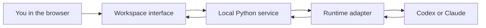

[← UX46](../README.md) · [Your first change](first-change.md) · **Code tour** · [Architecture →](architecture.md)

# Follow one click

You don't need to read the codebase from top to bottom. Start with a thing you
can see, then follow it far enough to understand what you want to change.

The main route looks like this:

The browser draws the workspace and sends requests. A local service receives
those requests. An **adapter** translates between UX46 and a particular agent's
session protocol. The provider's CLI runs the agent and owns its authentication
and native conversations. Responses travel back to the browser.

## The first file is deliberately small

Open [`tools/ux46`](../tools/ux46). It's the entrypoint: the file your launcher
runs. It checks the Python version and hands control to `main()` in
[`ux46_local.py`](../tools/ux46_local.py). A function called `main` is a common
place to start a command-line program; the name isn't magic.

In `ux46_local.py`, the command parser reads words such as `setup`, `run`, and
`doctor` and chooses the corresponding behavior. This is why `doctor` can check
prerequisites without starting an agent.

The longer-running `run()` function assembles the service. For Claude it starts
an internal local adapter; for Codex it configures the native app-server command.
Choosing `none` leaves a workspace with no local agent selected.

## The part you can see

| File | Think of it as… | A useful first question |
| :--- | :--- | :--- |
| [`index.html`](../app/console/index.html) | The interface's structure | Where is this button defined? |
| [`styles.css`](../app/console/styles.css) | Colors, spacing, and appearance | What makes this state look selected? |
| [`app.js`](../app/console/app.js) | Main interface behavior | What happens when this button is clicked? |
| [`workspace.js`](../app/console/workspace.js) / [`workspace.css`](../app/console/workspace.css) | Additional workspace views | Where does this panel get its contents? |
| [`modules.js`](../app/console/modules.js) | Which optional sections are shown | Why is Email hidden on a fresh install? |

**HTML** gives elements a place. **CSS** controls how they look. **JavaScript**
connects actions and updates. They work together; changing a button's label
doesn't change the action behind it.

Try [`modules.js`](../app/console/modules.js) for a short, complete example. It
hides unconfigured connectors, asks `/api/modules` for the installation's settings,
then updates visibility. That URL is an **API endpoint**: an address where code
asks for data rather than a whole page. Hiding a button isn't a security check;
the server must also enforce which operations are available.

## The part that handles the request

[`atlas_console.py`](../tools/atlas_console.py) contains the main HTTP service.
HTTP is the request/response language browsers use, including when the server is
on the same computer. [`ux46_local.py`](../tools/ux46_local.py) extends that service
with standalone configuration and workspace routes.

When you see `GET`, think “read.” When you see `POST`, look for an operation that
may change something. The request handler checks the local host, origin and, for
mutations, a CSRF token before dispatching. The token helps prevent an unrelated
web page from asking your local app to act on its behalf. These checks are a
boundary to preserve when adding routes, not UI decoration.

A runtime adapter then deals with provider-specific details. Codex's native
protocol is in [`atlas_native.py`](../tools/atlas_native.py); Claude's integration
is in [`atlas_claude.py`](../tools/atlas_claude.py). Changing a color doesn't need
either file. Adding support for another agent probably will need you to understand
[the adapter contract](adapter-contract.md).

## Why the app and your memories live apart

Your install has editable source in `~/ux46` and private settings in `~/.ux46`.
Project records live with the projects you register. This separation lets you
share a code improvement without automatically sharing your conversations.

In [`initialize()`](../tools/ux46_local.py), look for `.open('x')`. The `x` asks
Python to create a file only if it doesn't exist. If you ran setup twice, a normal
write could replace your settings with defaults. This one refuses that replacement
and keeps the existing file. A single letter is doing useful work there.

[`ux46_setup.py`](../tools/ux46_setup.py) creates a small connection record with
tool paths, settings and memory entrypoints. It checks whether a CLI executable
can be found; it doesn't read provider credentials or prove you're signed in.
That distinction matters when troubleshooting an app that opens but can't talk.

## The memory isn't another model

Session Vault keeps distilled project context and native pointers. Constellation
stores sourced lessons and reuse feedback, then retrieves a bounded selection
when relevant. Those utilities don't improve a model's underlying weights.
They give a future conversation better evidence without making it read everything.

[`ux46_memory.py`](../tools/ux46_memory.py) is a small command-line entrance to the
local learning store. It accepts and returns **JSON**, a text format for structured
data. Follow a named operation such as `brief` into
[`ux46_workspace_api.py`](../tools/ux46_workspace_api.py) and then
[`constellation_store.py`](../tools/constellation_store.py) when you need the details.

## The less polished corners are real too

Some filenames still say `atlas`, the project's earlier internal name. The main
JavaScript and server files are large. This tour is a route through the current
code, not a claim that every corner has been tidied or explained. Renaming and
splitting everything at once would make a bigger diff without necessarily making
your next change easier.

When you touch an unfamiliar area, ask your AI to explain its input, output,
private data, and failure behavior. Then make the change and check that behavior.
If a comment and the code disagree, investigate; a confident comment can't fix a bug.

**Next: [How to check a change without using your real conversations →](development.md)**
